# 第五次作业

## 作业要求
- 更新用户数据完成；
- 删除数据，自行研究；
- 将统计日志存储到数据库（排序后）

## 说明

执行app前需要先执行handle_logs.py，将已排序的日志写入数据库
access.txt放在当前目录

## 数据库相关内容
- 库：cmdb
- 表：users, accesslog
- 表结构

```
| users | CREATE TABLE `users` (
  `id` int(11) NOT NULL AUTO_INCREMENT,
  `name` varchar(30) NOT NULL,
  `password` varchar(64) NOT NULL,
  `age` int(11) NOT NULL,
  `job` varchar(30) NOT NULL,
  PRIMARY KEY (`id`)
) ENGINE=InnoDB AUTO_INCREMENT=29 DEFAULT CHARSET=utf8

| accesslog | CREATE TABLE `accesslog` (
  `id` int(11) NOT NULL AUTO_INCREMENT,
  `ip` varchar(25) DEFAULT NULL,
  `url` text,
  `status` int(11) DEFAULT NULL,
  `count` int(11) DEFAULT NULL,
  PRIMARY KEY (`id`)
) ENGINE=InnoDB AUTO_INCREMENT=44094 DEFAULT CHARSET=utf8 |
```


## 实现功能
1. 系统首页
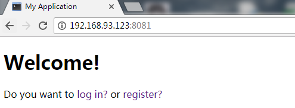

2. 用户注册，管理员为admin，需要注册

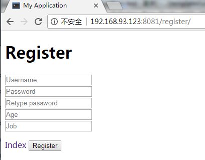

3. 当用户存在或密码不符合要求时有相应的提示

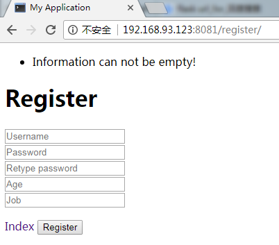

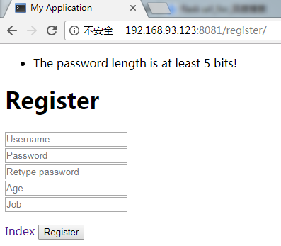

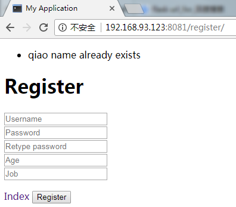

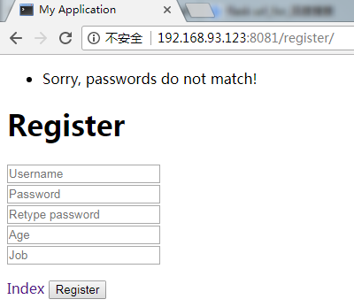

4. 注册成功

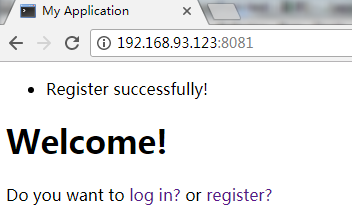

5. 用户登陆验证失败提示

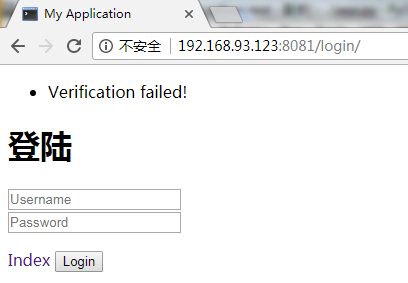

6. 普通用户登录及相关操作

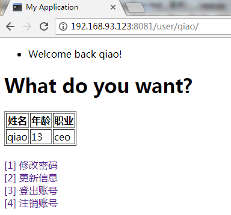

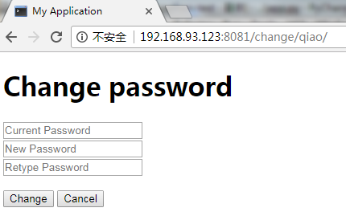


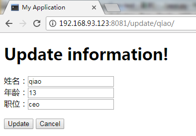

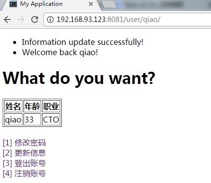

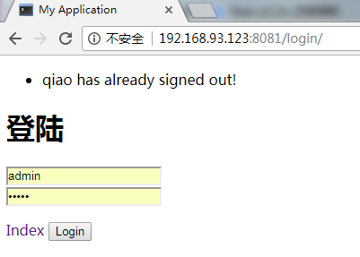

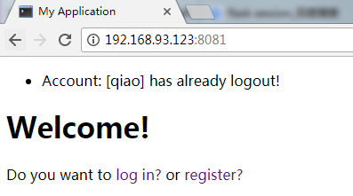

7. 管理员界面

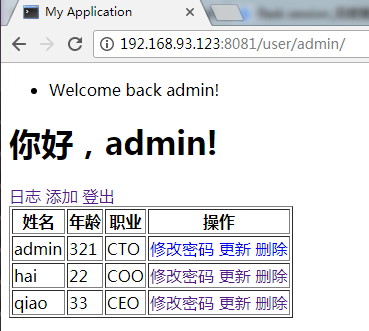


7. 普通用户界面


8. 添加日志（日志暂时不能按时间排序）


9. 当用户未登录，直接访问用户的url时的报错


